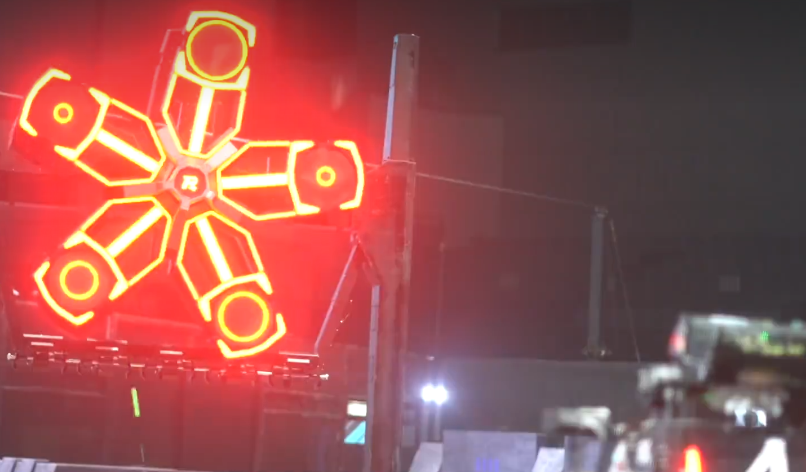

<div align="center" float="left">
<a href="https://www.robomaster.com/zh-CN">

</a>
&nbsp;&nbsp;&nbsp;&nbsp;&nbsp;&nbsp;&nbsp;&nbsp;&nbsp;

</div>

<br>

**<div align="center">哈尔滨工业大学 竞技机器人队 视觉组</div>**


# <div align="center"> &nbsp;&nbsp;&nbsp;&nbsp;&nbsp;能量机关🎯</div>


*<div align="right">by zmsbruce</div>*

### <div align="center"> 1. 简介📓 </div>

该项目为 **2023 年**、传统视觉下的**能量机关的识别**与**击打位置的预测**。其接收输入为当前时间、图像以及欧拉角 roll, pitch 和 yaw，输出为 pitch 和 yaw（默认不能改变 roll）。[main.cpp](./main.cpp) 中模拟一个示例，其按照设定好的帧率（30 帧）读取 [example.mp4](./example.mp4) 视频，并将欧拉角都设为 0。可以根据与相机、电机等协议进行个性化设置，打造出适合自己步兵机器人（也可以是哨兵）的车上代码。

> 代码仅包括识别与坐标解算，不包括串口通信、相机驱动部分。

> 要求为低曝光下的视频，并正确设置各项参数（在 [config.yaml](./config.yaml) 中）。亮度过高、或参数不正确会导致识别失败。

**有关能量机关算法的详细介绍，可以查看 [46 环的秘密—识别篇](https://zmsbruce.github.io/posts/46%E7%8E%AF%E7%9A%84%E7%A7%98%E5%AF%86-%E8%AF%86%E5%88%AB%E7%AF%87/) 和 [46 环的秘密—解算与拟合篇](https://zmsbruce.github.io/posts/46%E7%8E%AF%E7%9A%84%E7%A7%98%E5%AF%86-%E8%A7%A3%E7%AE%97%E4%B8%8E%E6%8B%9F%E5%90%88%E7%AF%87/) 这两篇文章。**

### <div align="center"> 2. 性能 🚀 </div>

在 Intel NUC 10 上，对 1280x1024 分辨率的图像中一帧的平均处理时间为 **4ms**，并能实现近乎 100% 的准确率识别。在大能量机关的预测上，其最大误差为 0.20 rad，平均 0.06 rad. 

在帧率为 208，机械弹道为 10m 小装甲板的情况下，以该项目组成的能量机关击打系统达到了**最高环数为 44 环**的成绩，创造了 2023 年 RoboMaster 超级对抗赛的记录。

### <div align="center"> 3. 安装 🔨 </div>

默认安装在 Ubuntu 20.04 系统。其它版本的 Ubuntu 系统、其他 Linux 系统、Windows 以及其它系统的有关库安装方法可以自行查询。

#### <div align="center"> 3.1 OpenCV 👁️  </div>

为了最大化发挥车上电脑的性能，推荐编译安装。逐行输入

```bash
sudo add-apt-repository "deb http://security.ubuntu.com/ubuntu xenial-security main"
sudo apt update
sudo apt install libjasper1 libjasper-dev
sudo apt install libavcodec-dev libavformat-dev
sudo apt install libgtk2.0-dev libswscale-dev pkg-config
sudo apt install python-dev python-numpy
sudo apt install libtbb2 libtbb-dev
sudo apt install libjpeg-dev libpng-dev libtiff5-dev
```

从 [https://github.com/opencv/opencv/archive/4.6.0.zip](https://github.com/opencv/opencv/archive/4.6.0.zip) 中下载 [OpenCV](https://opencv.org/) 压缩包（此处为 4.6.0 版本，其他版本可自行选择），解压缩后，在 OpenCV 根目录下依次输入：

```bash
mkdir build && cd build
cmake \
-D CMAKE_BUILD_TYPE=RELEASE \
-D CMAKE_INSTALL_PREFIX=/usr/local \
-D WITH_TBB=ON \
-D WITH_V4L=ON ..
make -j$(nproc)
sudo make install
```

等待安装完成即可。

#### <div align="center"> 3.2 ceres-solver 🔢  </div>

安装依赖：

```bash
# CMake
sudo apt-get install cmake
# google-glog + gflags +gtest
sudo apt-get install libgoogle-glog-dev libgflags-dev libgtest-dev
# Use ATLAS for BLAS & LAPACK
sudo apt-get install libatlas-base-dev
# Eigen3
sudo apt-get install libeigen3-dev
# SuiteSparse (optional)
sudo apt-get install libsuitesparse-dev
```

安装 [ceres-solver](http://ceres-solver.org/)：

```bash
git clone https://ceres-solver.googlesource.com/ceres-solver
cd ceres-solver
mkdir build && cd build
cmake ..
make -j$(nproc)
sudo make install
```

#### <div align="center"> 3.3 运行本项目 👻  </div>

```bash
git clone https://github.com/zmsbruce/rm_power_rune.git
cd rm_power_rune
mkdir build && cd build
cmake ..
make -j$(nproc)
../bin/power_rune
```

> 环境需要在 `./bin` 或同级目录上，否则会导致相对 路径错误从而无法运行

### <div align="center"> 4. 联系我 📧 </div>

如果对代码有疑问，或者想指出代码中的错误，可以通过邮件联系我：[zmsbruce@163.com](zmsbruce@163.com)。